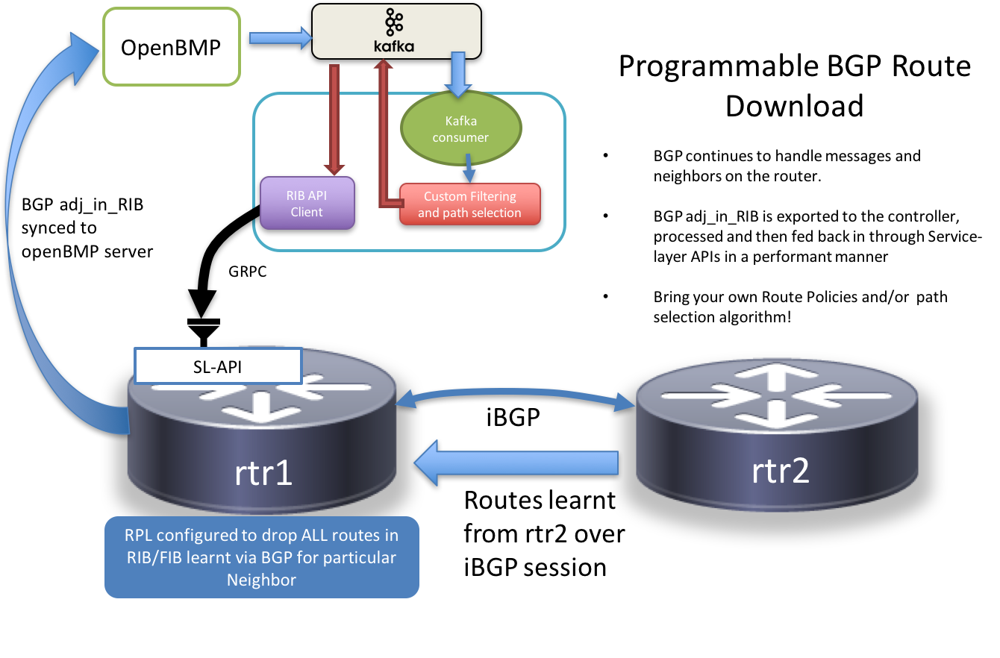
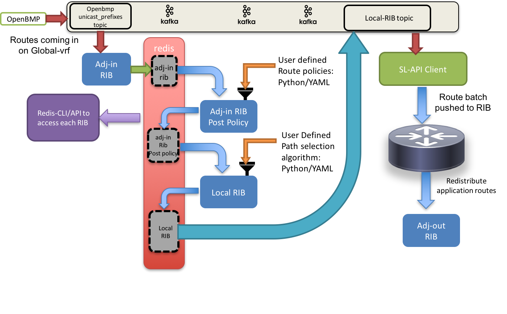
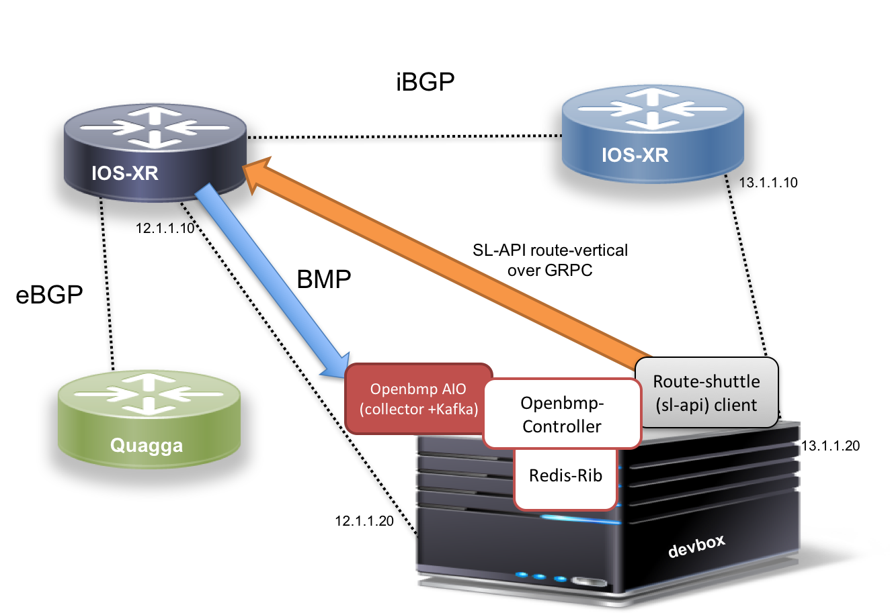

## Setup:



## Architecture


## Running the demo

The basic steps are as follows:

### Pre-requisites  

**Vagrant:**  

*  Have Vagrant and Virtualbox installed
*  Make sure you have access to an SL-API enabled IOS-XR vagrant box. If you don't have it get access to the IOS-XR vagrant box 
   (version = 6.1.2+) by following this tutorial:  [IOS-XR Vagrant Quickstart](https://xrdocs.github.io/application-hosting/tutorials/iosxr-vagrant-quickstart)


### Steps

**Note: You will need atleast 15G free RAM to run the vagrant topology.**

* The vagrant topology consists of four nodes as shown in the figure below:



*  Clone the git repository:

```
git clone https://github.com/akshshar/openbmp-controller.git

```

*  cd into the `vagrant/` directory and clone the Service Layer API repository into the directory

```
cisco@host:~/$ cd openbmp-controller/vagrant
cisco@host:~/openbmp-controller/vagrant$ git clone https://github.com/xrdocs-private/lindt-objmodel
Cloning into 'lindt-objmodel'...
Username for 'https://github.com': akshshar
Password for 'https://akshshar@github.com': 
remote: Counting objects: 229, done.
remote: Total 229 (delta 0), reused 0 (delta 0), pack-reused 229
Receiving objects: 100% (229/229), 5.03 MiB | 2.57 MiB/s, done.
Resolving deltas: 100% (106/106), done.
Checking connectivity... done.
cisco@host:~/openbmp-controller/vagrant$ 
```

*  Copy the `lib/` folder from the root of this repository into the `vagrant` folder

```
cisco@host:~/openbmp-controller/vagrant$ cp -r ../lib/ lib/
cisco@host:~/openbmp-controller/vagrant$ ls
compose  configs  daemon.json  lib  scripts  Vagrantfile
cisco@host:~/openbmp-controller/vagrant$
```


*  If you're behind a proxy, set the proxy variables as shown, the vagrant provisioning scripts will use them appropriately.

```
export http_proxy="http://proxy-server:80"
export https_proxy="https://proxy-server:80"

```

*  Now issue a `vagrant up` and go get a coffee :). This will take some time.


```
cisco@host:~/openbmp-controller/vagrant$ vagrant destroy --force; vagrant up
==> devbox: Forcing shutdown of VM...
==> devbox: Destroying VM and associated drives...
==> rtr3: Forcing shutdown of VM...
==> rtr3: Destroying VM and associated drives...
==> rtr2: Forcing shutdown of VM...
==> rtr2: Destroying VM and associated drives...
==> rtr1: Forcing shutdown of VM...
==> rtr1: Destroying VM and associated drives...
Bringing machine 'rtr1' up with 'virtualbox' provider...
Bringing machine 'rtr2' up with 'virtualbox' provider...
Bringing machine 'rtr3' up with 'virtualbox' provider...
Bringing machine 'devbox' up with 'virtualbox' provider...


```

Once the environment is up and running, ssh into rtr1 to view the BGP and BMP neighbors:

```
RP/0/RP0/CPU0:rtr1#show  bgp summary 
Wed Jul 26 01:46:35.642 UTC
BGP router identifier 1.1.1.1, local AS number 65000
BGP generic scan interval 60 secs
Non-stop routing is enabled
BGP table state: Active
Table ID: 0xe0000000   RD version: 12
BGP main routing table version 12
BGP NSR Initial initsync version 2 (Reached)
BGP NSR/ISSU Sync-Group versions 0/0
BGP scan interval 60 secs

BGP is operating in STANDALONE mode.


Process       RcvTblVer   bRIB/RIB   LabelVer  ImportVer  SendTblVer  StandbyVer
Speaker              12         12         12         12          12           0

Neighbor        Spk    AS MsgRcvd MsgSent   TblVer  InQ OutQ  Up/Down  St/PfxRcd
2.2.2.2           0 65000      35      37       12    0    0 00:29:39          0
11.1.1.20         0 65001      35      33       12    0    0 00:28:09          6

RP/0/RP0/CPU0:rtr1#show  bgp bmp summary  
Wed Jul 26 01:49:36.948 UTC
ID   Host                 Port     State   Time        NBRs
 1   12.1.1.20            5000     ESTAB   00:22:57    2   
RP/0/RP0/CPU0:rtr1#

```

Great! Now hop over to the devbox and view the running containers (you should see 4 of them):

*   **openbmp_aio** : All-in-one docker contains that contains an openbmp collector, mysql dB and a Kafka Bus.
*   **redis**:  A redis database to temporarily store the RIB and neighbor information.
*   **controller**:  The controller contains code from this repository and performs route-policy and path-selection before pushing the local RIB back into the kafka bus.
*    **rshuttle**: The route-shuttle container that contains code from route-shuttle library (<https://github.com/akshshar/route-shuttle>) withan an openbmp client to convert the incoming stream of routes from Redis or Kafka into a stream for the Service Layer API in IOS-XR.

```

cisco@host:~/openbmp-controller/vagrant$ vagrant ssh devbox
Welcome to Ubuntu 16.04.2 LTS (GNU/Linux 4.4.0-81-generic x86_64)

 * Documentation:  https://help.ubuntu.com
 * Management:     https://landscape.canonical.com
 * Support:        https://ubuntu.com/advantage

43 packages can be updated.
24 updates are security updates.


Last login: Wed Jul 26 01:51:16 2017 from 10.0.2.2
vagrant@vagrant:~$ docker ps
CONTAINER ID        IMAGE               COMMAND                  CREATED             STATUS              PORTS                                                                                                                              NAMES
f408c46e6047        openbmp/aio         "/usr/sbin/run_all..."   2 hours ago         Up 2 hours          0.0.0.0:2181->2181/tcp, 0.0.0.0:3306->3306/tcp, 0.0.0.0:5000->5000/tcp, 0.0.0.0:8001->8001/tcp, 0.0.0.0:9092->9092/tcp, 9999/tcp   openbmp_aio
ea4270c3dba6        controller:latest   "/bin/bash"              2 hours ago         Up 2 hours                                                                                                                                             controller
35dc15073b61        redis               "docker-entrypoint..."   2 hours ago         Up 2 hours          0.0.0.0:6379->6379/tcp                                                                                                             redisrib
aa4923d9ff81        grpcio:latest       "/bin/bash"              2 hours ago         Up 2 hours                                                                  

```

### Starting the Controller

On the devbox, exec into the controller container and start the "openbmp controller". You should see a stream of routes pouring in if you select the "verbose" (-v) knob. 


```
vagrant@vagrant:~$ 
vagrant@vagrant:~$ docker exec -it controller bash
root@controller:/# 
root@controller:/# 
root@controller:/# cd data/lib/
root@controller:/data/lib# python consumer.py -h
usage: consumer.py [-h] -r REDIS_HOST -b BOOTSTRAP_SERVER [-v]

optional arguments:
  -h, --help            show this help message and exit
  -r REDIS_HOST, --redis-host REDIS_HOST
                        Specify the Redis Server IP
  -b BOOTSTRAP_SERVER, --bootstrap-server BOOTSTRAP_SERVER
                        Specify hostname of the kafka cluster
  -v, --verbose         Enable verbose logging
root@controller:/data/lib# python consumer.py -r 12.1.1.20 -b 12.1.1.20 -v 
INFO:root:Starting verbose debugging
DEBUG:root:Connecting to Kafka to receive router messages
INFO:root:Connecting to Kafka to receive peer messages
DEBUG:root:Connecting to Kafka to receive prefix messages
INFO:root:Received Redis event
INFO:root:Received Redis event
INFO:root:Received Redis event
DEBUG:root:Received an AdjInRib event
INFO:root:Received Redis event
INFO:root:Received Redis event
INFO:root:Received Redis event
INFO:root:Received Redis event
DEBUG:root:% openbmp.parsed.router [0] reached end at offset 0

DEBUG:root:% openbmp.parsed.peer [0] reached end at offset 0

DEBUG:root:% openbmp.parsed.unicast_prefix [0] reached end at offset 0

DEBUG:root:% openbmp.parsed.router [1] reached end at offset 0

DEBUG:root:% openbmp.parsed.router [2] reached end at offset 0

DEBUG:root:Received Message (2017-07-26 01:50:50.236257) : ROUTER(V: 1.6)
DEBUG:root:[
    {
        "hash": "7fbf77c12967d9101d4383e10cfb1cb2", 
        "name": "rtr2", 
        "seq": 0, 
        "init_data": "", 


```

 
### Starting the SL-API (route-shuttle) client

Once the controller has started, open up another shell into devbox and start the sl-api (route-shuttle) client. Currently it is hardcoded to use the rtr1 hash and query both Redis and Kafka to get a stream of routes. The router hash will be queried via Redis directly in upcoming changes to the route-shuttle code.
The openbmp client and plugin for route-shuttle will convert the incoming stream of routes from Redis and Kafka into a route batch for the XR RIB over GRPC:


```

cisco@host:~/openbmp-controller/vagrant$ vagrant ssh devbox
Welcome to Ubuntu 16.04.2 LTS (GNU/Linux 4.4.0-81-generic x86_64)

 * Documentation:  https://help.ubuntu.com
 * Management:     https://landscape.canonical.com
 * Support:        https://ubuntu.com/advantage

43 packages can be updated.
24 updates are security updates.


Last login: Wed Jul 26 01:50:11 2017 from 10.0.2.2
vagrant@vagrant:~$ docker exec -it rshuttle bash
root@rshuttle:/# cd /data/route-shuttle/
root@rshuttle:/data/route-shuttle# python openbmp-client.py -h
usage: openbmp-client.py [-h] -i SERVER_IP -p SERVER_PORT -b BOOTSTRAP_SERVER
                         -r REDIS_HOST [-v]

optional arguments:
  -h, --help            show this help message and exit
  -i SERVER_IP, --server-ip SERVER_IP
                        Specify the IOS-XR GRPC server IP address
  -p SERVER_PORT, --server-port SERVER_PORT
                        Specify the IOS-XR GRPC server port
  -b BOOTSTRAP_SERVER, --bootstrap-server BOOTSTRAP_SERVER
                        Specify hostname of the kafka cluster
  -r REDIS_HOST, --redis-host REDIS_HOST
                        Specify the redis server host
  -v, --verbose         Enable verbose logging
root@rshuttle:/data/route-shuttle# python openbmp-client.py -i 12.1.1.10 -p 57777 -b 12.1.1.20 -r 12.1.1.20 -v
INFO:root:Starting verbose debugging
INFO:root:Using GRPC Server IP(12.1.1.10) Port(57777)
DEBUG:root:Global thread spawned
DEBUG:root:Received event from GRPC server
DEBUG:root:Server Returned 0x501, Version 0.0.0
DEBUG:root:Successfully Initialized, connection established!
DEBUG:root:Max VRF Name Len     : 33
DEBUG:root:Max Iface Name Len   : 64
DEBUG:root:Max Paths per Entry  : 128
DEBUG:root:Max Prim per Entry   : 64
DEBUG:root:Max Bckup per Entry  : 64
DEBUG:root:Max Labels per Entry : 3
DEBUG:root:Min Prim Path-id     : 1
DEBUG:root:Max Prim Path-id     : 64
DEBUG:root:Min Bckup Path-id    : 65
DEBUG:root:Max Bckup Path-id    : 128
DEBUG:root:Max Remote Bckup Addr: 2
DEBUG:root:VRF SL_REGOP_REGISTER Success!
DEBUG:root:VRF SL_REGOP_EOF Success!
DEBUG:root:{'paths': {}, 'prefix_len': 24, 'prefix': '10.0.2.0/24', 'family': 2, 'network': '10.0.2.0'}
DEBUG:root:{'paths': {}, 'prefix_len': 24, 'prefix': '11.1.1.0/24', 'family': 2, 'network': '11.1.1.0'}
DEBUG:root:{'paths': {}, 'prefix_len': 24, 'prefix': '20.1.1.0/24', 'family': 2, 'network': '20.1.1.0'}
DEBUG:root:{'paths': {}, 'prefix_len': 24, 'prefix': '20.1.2.0/24', 'family': 2, 'network': '20.1.2.0'}
DEBUG:root:{'paths': {}, 'prefix_len': 24, 'prefix': '20.1.3.0/24', 'family': 2, 'network': '20.1.3.0'}
DEBUG:root:{'paths': {}, 'prefix_len': 24, 'prefix': '20.1.4.0/24', 'family': 2, 'network': '20.1.4.0'}
DEBUG:root:{'paths': {'nexthop': '2.2.2.2', 'event': 'add', 'family': 2, 'admin_distance': 200}, 'prefix_len': 24, 'prefix': '100.1.1.0/24', 'family': 2, 'network': '100.1.1.0'}
DEBUG:root:{'paths': {'nexthop': '2.2.2.2', 'event': 'add', 'family': 2, 'admin_distance': 200}, 'prefix_len': 24, 'prefix': '100.2.1.0/24', 'family': 2, 'network': '100.2.1.0'}


```
 
Once the SL-API client starts running, you should be able to check the default VRF route table to see the application routes being pumped in

```
cisco@host:~/openbmp-controller/vagrant$ ssh -p 2223 vagrant@localhost
Password: 


RP/0/RP0/CPU0:rtr1#show route
Wed Jul 26 03:26:02.671 UTC

Codes: C - connected, S - static, R - RIP, B - BGP, (>) - Diversion path
       D - EIGRP, EX - EIGRP external, O - OSPF, IA - OSPF inter area
       N1 - OSPF NSSA external type 1, N2 - OSPF NSSA external type 2
       E1 - OSPF external type 1, E2 - OSPF external type 2, E - EGP
       i - ISIS, L1 - IS-IS level-1, L2 - IS-IS level-2
       ia - IS-IS inter area, su - IS-IS summary null, * - candidate default
       U - per-user static route, o - ODR, L - local, G  - DAGR, l - LISP
       A - access/subscriber, a - Application route
       M - mobile route, r - RPL, t - Traffic Engineering, (!) - FRR Backup path

Gateway of last resort is 10.0.2.2 to network 0.0.0.0

S   0.0.0.0/0 [1/0] via 10.0.2.2, 02:18:14, MgmtEth0/RP0/CPU0/0
L    1.1.1.1/32 is directly connected, 02:16:08, Loopback0
O    2.2.2.2/32 [110/2] via 10.1.1.20, 02:09:11, GigabitEthernet0/0/0/0
L    6.6.6.6/32 is directly connected, 02:16:08, Loopback1
C    10.0.2.0/24 is directly connected, 02:18:14, MgmtEth0/RP0/CPU0/0
L    10.0.2.15/32 is directly connected, 02:18:14, MgmtEth0/RP0/CPU0/0
C    10.1.1.0/24 is directly connected, 02:16:08, GigabitEthernet0/0/0/0
L    10.1.1.10/32 is directly connected, 02:16:08, GigabitEthernet0/0/0/0
C    11.1.1.0/24 is directly connected, 02:16:08, GigabitEthernet0/0/0/1
L    11.1.1.10/32 is directly connected, 02:16:08, GigabitEthernet0/0/0/1
C    12.1.1.0/24 is directly connected, 02:16:08, GigabitEthernet0/0/0/2
L    12.1.1.10/32 is directly connected, 02:16:08, GigabitEthernet0/0/0/2
B    20.1.1.0/24 [20/0] via 11.1.1.20, 02:07:35
B    20.1.2.0/24 [20/0] via 11.1.1.20, 02:07:35
B    20.1.3.0/24 [20/0] via 11.1.1.20, 02:07:35
B    20.1.4.0/24 [20/0] via 11.1.1.20, 02:07:35
a    100.1.1.0/24 [200/0] via 2.2.2.2, 01:34:10
a    100.2.1.0/24 [200/0] via 2.2.2.2, 01:34:10
a    100.3.1.0/24 [200/0] via 2.2.2.2, 01:34:10
a    100.4.1.0/24 [200/0] via 2.2.2.2, 01:34:10
a    100.5.1.0/24 [200/0] via 2.2.2.2, 01:34:10
a    100.6.1.0/24 [200/0] via 2.2.2.2, 01:34:10
a    100.7.1.0/24 [200/0] via 2.2.2.2, 01:34:10
a    100.8.1.0/24 [200/0] via 2.2.2.2, 01:34:10
a    100.9.1.0/24 [200/0] via 2.2.2.2, 01:34:10
a    100.10.1.0/24 [200/0] via 2.2.2.2, 01:34:10
a    100.11.1.0/24 [200/0] via 2.2.2.2, 01:34:10
a    200.1.1.0/24 [200/0] via 2.2.2.2, 01:34:10
a    200.2.1.0/24 [200/0] via 2.2.2.2, 01:34:10
a    200.3.1.0/24 [200/0] via 2.2.2.2, 01:34:10
a    200.4.1.0/24 [200/0] via 2.2.2.2, 01:34:10
a    200.5.1.0/24 [200/0] via 2.2.2.2, 01:34:10
a    200.6.1.0/24 [200/0] via 2.2.2.2, 01:34:10
a    200.7.1.0/24 [200/0] via 2.2.2.2, 01:34:10
a    200.8.1.0/24 [200/0] via 2.2.2.2, 01:34:10
a    200.9.1.0/24 [200/0] via 2.2.2.2, 01:34:10
RP/0/RP0/CPU0:rtr1#


```


With this setup running, play around by changing routes being injected by rtr2 to see how the application routes follow the events. Further, try to vary routepolicy.py and pathselection.py files to see how easily the incoming routes can be manipulated based on BGP path attributes.


 
