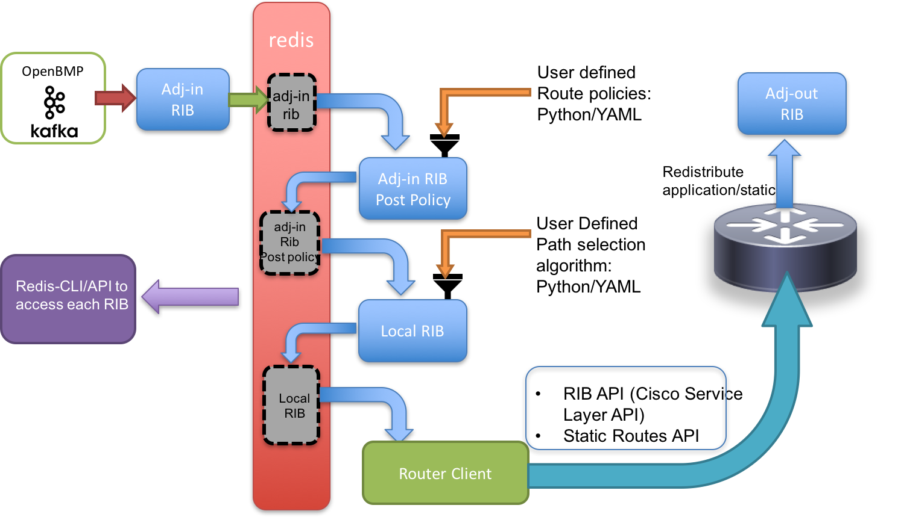

# openbmp-controller
Kafka based openbmp client/consumer that manages BGP RIB tables

The Basic architecture is shown below:



# Vagrant Setup

To bring up the vagrant environment make sure you have around 12G -14 G RAM available. The IOS-XR vagrant boxes we use in the Vagrantfile need about 4G RAM each, and so does the openbmp_aio docker images inside the devbox (see Vagrantfile).

Issue a vagrant up in the vagrant/ directory:

```
cd vagrant/
vagrant up

```

SSH into devbox and drop into the kafka-slapi container:

```
host:~/openbmp-controller/vagrant/$ vagrant ssh devbox
Welcome to Ubuntu 16.04.2 LTS (GNU/Linux 4.4.0-75-generic x86_64)

 * Documentation:  https://help.ubuntu.com
 * Management:     https://landscape.canonical.com
 * Support:        https://ubuntu.com/advantage

36 packages can be updated.
9 updates are security updates.


Last login: Wed Jun  7 17:20:00 2017 from 10.0.2.2
vagrant@vagrant:~$ 
vagrant@vagrant:~$ 
vagrant@vagrant:~$ 
vagrant@vagrant:~$ pwd
/home/vagrant
vagrant@vagrant:~$ docker exec -it kafka_slapi bash

```

Now run the controller by starting the consumer:

```
root@kafka-slapi:~# python consumer.py -i 12.1.1.10 -p 57777 -b 12.1.1.20 -v
```
